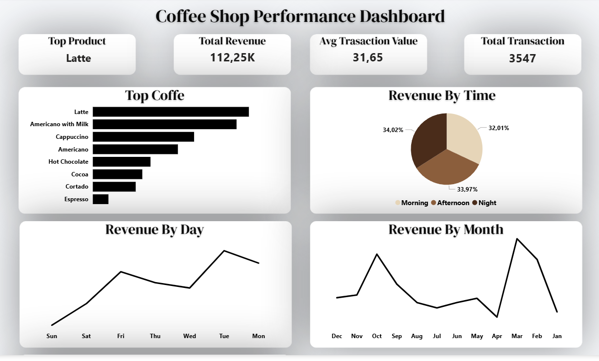

# ☕ Coffee Shop Sales Performance Dashboard

## 📌 Deskripsi Proyek

Proyek ini bertujuan untuk menganalisis data transaksi sebuah coffee shop guna mendapatkan insight bisnis yang dapat membantu pengambilan keputusan. Analisis dilakukan mulai dari proses pembersihan data (*data cleaning*), eksplorasi data (*EDA*), hingga pembuatan dashboard interaktif menggunakan Power BI.

## 🎯 Tujuan Analisis

Analisis ini dilakukan untuk menjawab beberapa pertanyaan bisnis berikut:

* Produk kopi apa yang menghasilkan revenue terbesar?
* Kapan waktu penjualan paling tinggi terjadi?
* Hari apa yang memberikan kontribusi revenue terbesar?
* Bagaimana tren revenue dari bulan ke bulan?
* Berapa rata-rata nilai transaksi pelanggan?

## 🛠 Tools yang Digunakan

* Microsoft Excel → Data Cleaning & Data Preparation
* Power BI → Dashboarding & Data Visualization

## 🧹 Proses Data Cleaning

Beberapa tahapan pembersihan data yang dilakukan:

* Import dataset CSV ke Excel
* Memperbaiki format tanggal dan waktu
* Mengubah kolom revenue menjadi format numerik
* Memvalidasi data yang hilang (*missing values*)
* Memeriksa data duplikat
* Menyiapkan dataset untuk proses analisis

## 📊 Exploratory Data Analysis (EDA)

Analisis yang dilakukan meliputi:

* Total Revenue
* Total Transaksi
* Average Transaction Value
* Analisis Produk Terlaris
* Revenue Berdasarkan Waktu (Morning, Afternoon, Night)
* Revenue Berdasarkan Hari
* Tren Revenue Bulanan

## 📈 Dashboard Preview

## 🔍 Insight Utama

### 1. Latte merupakan produk dengan performa terbaik

Latte menghasilkan revenue tertinggi dibandingkan produk lainnya sehingga menjadi kontributor utama pendapatan coffee shop.

### 2. Hari Selasa menghasilkan revenue tertinggi

Aktivitas pembelian pelanggan paling tinggi terjadi pada hari Selasa dibandingkan hari lainnya.

### 3. Distribusi revenue relatif merata sepanjang hari

Revenue dari Morning, Afternoon, dan Night memiliki proporsi yang cukup seimbang sehingga tidak terdapat ketergantungan pada satu periode tertentu.

### 4. Rata-rata nilai transaksi sebesar 31,65

Setiap pelanggan mengeluarkan rata-rata 31,65 dalam satu transaksi.

## 💡 Rekomendasi Bisnis

* Mempertahankan kualitas dan ketersediaan produk Latte sebagai produk unggulan.
* Melakukan evaluasi faktor yang menyebabkan tingginya penjualan pada hari Selasa.
* Mengembangkan strategi upselling untuk meningkatkan rata-rata nilai transaksi.
* Memanfaatkan pola penjualan yang stabil sepanjang hari untuk mengoptimalkan operasional.

## 🚀 Skill yang Dipelajari

* Data Cleaning
* Data Preparation
* Exploratory Data Analysis (EDA)
* Data Visualization
* Dashboard Development
* Business Insight Generation
* Microsoft Excel
* Power BI

